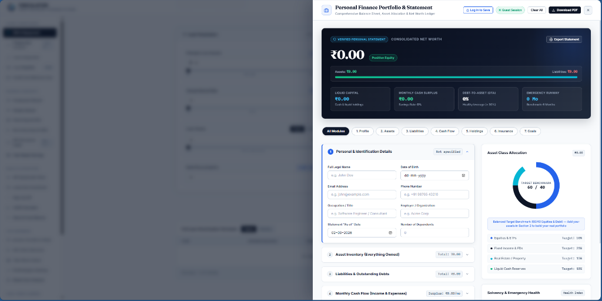
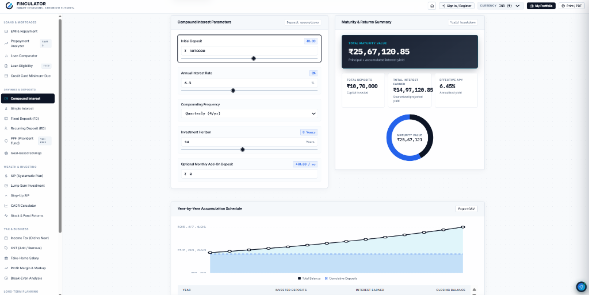

# FINCULATOR — High-Utility Financial Engineering & Computation Suite

[](https://developer.mozilla.org/en-US/docs/Web/JavaScript)
[](https://developer.mozilla.org/en-US/docs/Web/CSS)
[](LICENSE)
[](#-testing--verification)
[](#-deployment--hosting)

**FINCULATOR** is an institutional-grade financial computation suite designed with an **Obsidian Slate** aesthetic, pure ES Modules architecture, responsive SVG data visualization, and 27 financial math models across 5 core categories.

---

## Interface Preview

<div align="center">
  
  <p><em>Institutional Gateway & Hero Experience: Conversion gate, banknote growth artwork, and secure guest access.</em></p>

  <br />

  
  <p><em>Personal Finance Portfolio & Statement: Consolidated net worth ledger, dual-tone balance sheet bar, and 60/40 benchmark allocation.</em></p>

  <br />

  
  <p><em>Wealth Accumulation & Yield Engines: Interactive maturity metrics, asset donut visualizer, and year-by-year trajectory curves.</em></p>
</div>

---

## Comprehensive Financial Modules

### 1. Loans & Mortgages
* **EMI & Repayment Calculator**: Precision monthly amortization ($E = P \cdot r \cdot \frac{(1+r)^n}{(1+r)^n - 1}$), fee structuring, principal/interest breakdown, and step-down amortization schedule.
* **Prepayment Analyzer**: Model recurring monthly prepayments and annual lump-sum debt acceleration to compute total interest saved and tenure cut-off.
* **Multi-Scenario Loan Comparator**: Side-by-side evaluation of up to 3 competitive mortgage offers with dynamic **"Best Value (Lowest Lifetime Cost)"** detection.
* **Loan Eligibility Calculator**: Reverse-solves maximum borrowing ceiling using institutional FOIR (Fixed Obligation to Income Ratio) and DTI metrics.
* **Credit Card Minimum-Due Calculator**: Demonstrates the compound interest debt trap of minimum payments vs. accelerated fixed monthly payoff.

### 2. Savings & Deposits
* **Compound Interest Calculator**: Compounding across Daily (365x), Monthly (12x), Quarterly (4x), Semi-Annual (2x), and Annual (1x) frequencies with recurring deposits.
* **Simple Interest Calculator**: Linear interest computations across fixed tenures.
* **Fixed Deposit (FD) Calculator**: Fixed-term deposit accumulation with flexible compounding.
* **Recurring Deposit (RD) Calculator**: Systematic monthly banking deposits with maturity forecasts.
* **PPF (Public Provident Fund) Calculator**: 15-year sovereign tax-exempt compounding and milestone schedules.
* **Goal-Based Savings (Reverse Compound)**: Reverse-solves required monthly savings to achieve a target financial corpus.

### 3. Wealth & Investing
* **SIP (Systematic Investment Plan)**: Monthly mutual fund and equity forecasting using annuity-due compounding.
* **Lump Sum Investment**: Long-term single-deposit compounding curves.
* **SIP + Lump Sum Combined**: Simultaneous initial corpus deployment with ongoing monthly investments.
* **Step-Up SIP**: Annual percentage increase in monthly contributions.
* **CAGR Calculator**: Compound Annual Growth Rate and absolute gain metrics.
* **Stock & Mutual Fund Returns**: Absolute and annualized performance analytics including dividend income.

### 4. Tax & Business
* **Income Tax Calculator (Old vs New Regime)**: Comprehensive tax liability analysis under the Indian IT framework with automated regime recommendation and savings delta.
* **GST Calculator**: Standard tax slabs (5%, 12%, 18%, 28%) with **Add GST (Exclusive)** and **Remove GST (Inclusive)** modes and CGST/SGST split.
* **Take-Home / Net Salary Calculator**: Annual CTC breakdown into Basic, HRA, Employee PF, and Net Monthly In-Hand Pay.
* **Profit Margin & Markup Calculator**: Cost price, selling price, gross margin %, markup %, and total business profit.
* **Break-Even Analysis Calculator**: Fixed overhead recovery, unit variable cost, contribution margin, and break-even unit threshold.

### 5. Long-Term Planning & Economics
* **Retirement & FIRE Corpus Engine**: Comprehensive FIRE targets accounting for inflation and Safe Withdrawal Rates (SWR 3%-5%), with **Lean FIRE (75%)**, **Standard FIRE (100%)**, **Fat FIRE (130%)**, and **Coast FIRE** milestones.
* **Inflation Adjuster**: Real purchasing power degradation schedule and future equivalent costs.
* **Net Worth Calculator**: Comprehensive asset inventory vs. liabilities analysis with Debt-to-Asset solvency ratios.
* **50/30/20 Budget Planner**: Structures monthly cash flows into Essential Needs (50%), Discretionary Wants (30%), and Savings (20%).
* **Buy vs. Rent Comparison**: 10–30 year wealth trajectory comparison between homebuyer equity accumulation vs. renter stock market portfolio.

---

## Design System & Visual Identity

* **Palette**: `#0D1526` (Obsidian Navy), `#1E293B` (Slate Navy), `#2563EB` (Electric Blue), `#06B6D4` (Cyan Accent), `#F8FAFC` (Canvas Light), `#FFFFFF` (Surface White).
* **Typography**:
  * **Headings**: *Fraunces* editorial display serif.
  * **UI & Controls**: *Inter* clean grotesque.
  * **Financial Numerals**: *IBM Plex Mono* with `font-variant-numeric: tabular-nums lining-nums`.
* **Zero External Dependencies**: Pure vanilla JavaScript (ES6 Modules) and native CSS — no bundlers or heavyweight frameworks required.
* **SVG Data Visualizations**: Custom interactive Donut Breakdown charts, Stacked Area curves, and Amortization Trajectory graphs with hover tooltips.
* **Multi-Currency System**: Instant switching between **USD ($)**, **EUR (€)**, **GBP (£)**, **INR (₹)** with Indian lakh/crore grouping, **JPY (¥)**, **CAD (C$)**, **AUD (A$)**, and **CHF (₣)**.
* **Print & Export Engine**: One-click CSV downloads for all schedules and light-mode ink-saving `@media print` stylesheets for PDF generation.

---

## Project Architecture

```
finance-calculator/
├── index.html                   # Clean semantic HTML5 layout shell
├── server.py                    # Multi-threaded local development server (Port 3000)
├── .gitignore                   # Git exclusion rules
├── docs/
│   └── images/                  # UI screenshot previews
├── css/
│   ├── main.css                 # Design tokens, typography, header, sidebar, footer
│   ├── components.css           # Buttons, inputs, tactile sliders, cards, badges
│   ├── calculators.css          # Tables, comparison grids, FIRE cards, scenario matrix
│   ├── charts.css               # Interactive SVG Donut charts & Trajectory curves
│   └── print.css                # Ink-saving print/PDF report stylesheet
├── js/
│   ├── app.js                   # Application coordinator, router, and currency state
│   ├── math/
│   │   └── financeMath.js       # Pure standalone financial math library (27 algorithms)
│   ├── components/
│   │   ├── logo.js              # Vector SVG brand logo generator
│   │   ├── charts.js            # Interactive SVG Donut & Growth charts
│   │   └── amortizationTable.js # Table with pagination, search, yearly/monthly views & CSV
│   ├── calculators/
│   │   ├── emiCalculator.js     # EMI, Amortization, and Loan Repayment view
│   │   ├── prepaymentAnalyzer.js# Prepayment, interest saved, and payoff accelerator
│   │   ├── loanComparator.js    # 3-scenario loan comparator with Best Value badge
│   │   ├── loanEligibility.js   # FOIR / DTI borrowing capacity reverse solver
│   │   ├── creditCardCalculator.js# Credit card minimum due vs fixed payment payoff
│   │   ├── savingsDepositsSuite.js# Compound, Simple, FD, RD, PPF, Goal Savings
│   │   ├── investmentSuite.js   # SIP, Lump Sum, Step-Up SIP, CAGR, Returns
│   │   ├── taxBusinessSuite.js  # Income Tax (Old vs New), GST, Salary, Margin, Break-even
│   │   ├── fireCalculator.js    # Retirement & FIRE milestone planner
│   │   ├── inflationCalculator.js# Purchasing power erosion & future cost view
│   │   ├── netWorthCalculator.js# Assets vs Liabilities & allocation breakdown
│   │   ├── budgetPlanner.js     # 50/30/20 Budget allocation tool
│   │   └── buyVsRentCalculator.js# Buy vs Rent 10-30 year wealth trajectory
│   └── utils/
│       ├── formatters.js        # Multi-currency formatting & Indian lakh support
│       ├── storage.js           # LocalStorage state persistence
│       └── export.js            # CSV generator & print handler
├── src/utils/
│   └── financeMath.ts           # Pure TypeScript models & definitions
└── tests/
    ├── test_math.py             # Python automated unit test suite (100% Pass)
    ├── test_runner.html         # In-browser verification test runner
    └── verify_server.py         # HTTP endpoint and asset validation
```

---

## Quick Start & Local Development

### Prerequisites
- Python 3.x (or any static HTTP server)

### 1. Clone the repository
```bash
git clone https://github.com/prakharrai12/finculator.git
cd finculator
```

### 2. Start the local server
```bash
python server.py
```

### 3. Open in Browser
Visit **`http://localhost:3000`** in your browser.

---

## Testing & Verification

### Run Python Automated Unit Tests
```bash
python -m unittest tests/test_math.py
```
*Validates all 27 financial math models with floating-point precision.*

### In-Browser Verification Suite
Open `http://localhost:3000/tests/test_runner.html` in your browser to run live assertions across all interactive modules.

---

## Deployment & Hosting

Finculator is 100% client-side compatible and can be hosted on any static hosting provider with zero configuration:

### GitHub Pages
1. Push this repository to GitHub.
2. Go to **Settings** → **Pages**.
3. Under **Build and deployment**, select **Deploy from a branch** (`main` branch, `/ (root)` folder).
4. Click **Save** — your site will be live instantly!

### Vercel / Netlify
1. Connect your GitHub repository to Vercel or Netlify.
2. Set Build Command to empty (or leave default).
3. Set Publish directory to `./` (root).
4. Deploy.

---

## License
This project is open-source and available under the [MIT License](LICENSE).
